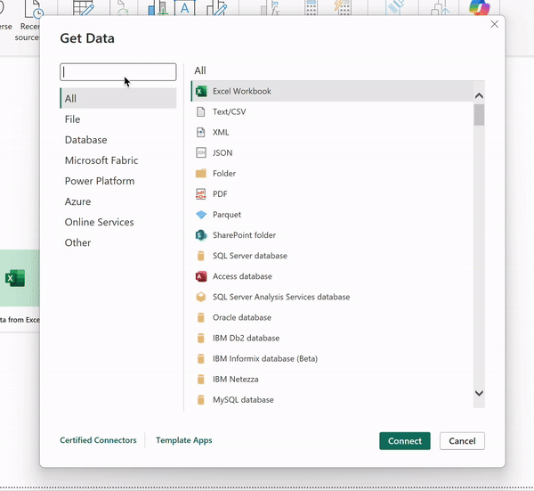

<p align="center">
    &nbsp;<br /><br />
  
  
  <h1 align="center">Open Snowflake Connector for Power BI</h1>
</p>

## Overview

The Open Power BI connector for Snowflake builds on the default capabilities to support the `username_password_mfa` authenticator by default, reducing multi-factor authentication prompts for a streamlined experience. The connector also includes advanced ODBC driver settings to support flexible configuration.

<p align="center">
  
</p>


## Key Features

- **Hooks into the PowerBI OEM Snowflake Driver**: No need to install or update additional drivers.
- **Direct Query Support**: Retrieve real-time data from Snowflake directly in Power BI.
- **Enhanced Authentication**: Utilises the `username_password_mfa` setting by default to mitigate excessive MFA prompts.
- **Driver Configuration**: Customise ODBC driver settings for a tailored data connection experience.

## Limitations

- **EntraId**: Supports OAuth but not EntraId (sad face)
- ~~**Custom (Native) Query**: Not supported (yet). See: [Issue #2](https://github.com/dcrdev/open-powerbi-connector-snowflake/issues/2)~~
- **Compatibility with PowerBI.com**: Requires a manual edit in your PBIX file. See: [Issue #1](https://github.com/dcrdev/open-powerbi-connector-snowflake/issues/1)

## Installation

1. **Set Up Custom Connector Directory**  
   Create a custom connector directory at `[Documents]\Power BI Desktop\Custom Connectors`.

2. **Download the Connector**  
   Retrieve the latest release from the [Releases section](https://github.com/dcrdev/power-bi-snowflake/releases) and place it in the custom connector directory.

3. **Enable Unsigned Connectors in Power BI**  
   In Power BI, go to *File* > *Options and settings* > *Options* > *Security* > *Data Extensions* and select *Allow any extension to load without warning or validation*.

## Development

1. **Install Power Query SDK for Visual Studio Code**  
   Install the latest version of the Power Query SDK through the [Visual Studio Code Marketplace](https://marketplace.visualstudio.com/items?itemName=PowerQuery.vscode-powerquery-sdk).

2. **Set Credentials**  
   In Visual Studio Code, set the username/password credentials via the Power Query SDK toolbox.

3. **Script to Link Embedded Driver**  
   Run the `create_embedded_driver_link_path.ps1` script to create a symbolic link for the Microsoft OEM Simba driver in the SDK, which is required for embedded driver compatibility with this connector.

   - The script parameters allow you to set the SDK and tools versions as needed.
   - Save and run the script with the following command:
     ```powershell
     # Execute with parameters matching your installed versions
     .\create_embedded_driver_link_path.ps1 -SDKVersion "0.4.0-win32-arm64" -SDKToolsVersion "2.127.3"
     ```

4. **Connector Configuration**  
   Update the `SnowflakeConnector.query.pq.example` file with your server and warehouse details and then rename to `SnowflakeConnector.query.pq`:
   ```m
   let
       // Set server and warehouse directly in the script
       server = "contoso.snowflakecomputing.com",
       warehouse = "CONTOSO_WH",

       // Define additional options
       options = [
           LogLevel = 6,
           LogPath = "C:\\temp"
       ],
       config = [
           roleName = null,                            // Optional role name
           commandTimeout = null,                      // Optional command timeout
           connectionTimeout = null,                   // Optional connection timeout
           includeRelationshipColumns = null,          // Optional include relationship columns
           database = null,                            // Optional database
           options = options                           // Additional options
       ],

       // Call Snowflake.Database with sourced parameters
       result = Snowflake
## References
https://github.com/ClickHouse/power-bi-clickhouse
https://github.com/microsoft/DataConnectors/tree/master/samples/ODBC/SnowflakeODBC
https://github.com/microsoft/DataConnectors/tree/master/samples/NativeQuery/ODBC/SQL%20ODBC/Finish

## CAUTION

This connector is provided without warranty, and I assume no liability for any issues arising from its use. Note that enabling this connector will replace the default Snowflake connector in the Power BI interface, thereby disabling access to the built-in connector.
